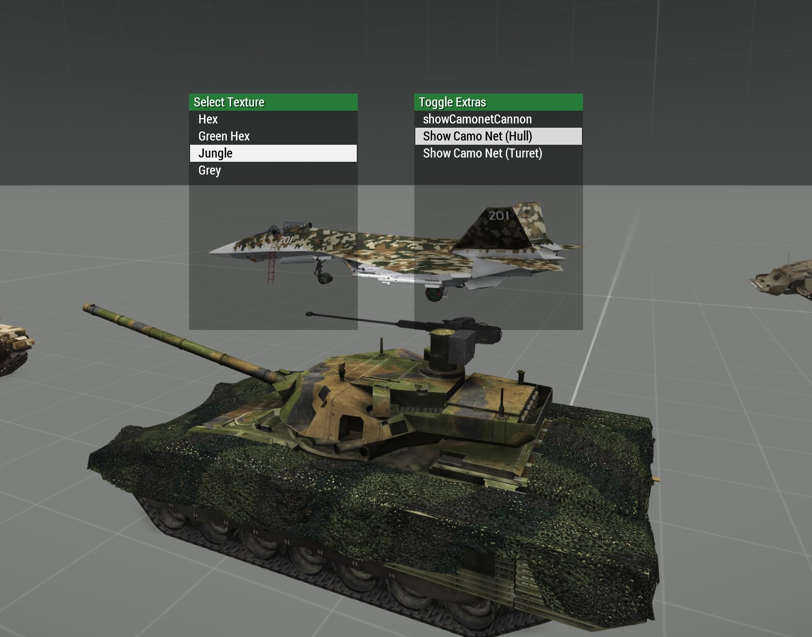

# Arma 3 - Texture Swap Script

Dead-simple vehicle texture change script

## Features
  - Change the texture of the currently controlled vehicle
  - Toggle animations of the vehicle (e.g. bags, camo nets, tools, ...)

## Preview

## Installation

The included showcase adds a support module to trigger the functionality, but that is not necessary. You could call `[player] call F85_TextureSwap_showVehicleSubMenu` from any user interaction.

However, currently the script expects the player to sit inside of the vehicle which he wants to change.

- Copy the `F85_TextureSwap` folder
- Add (or merge) the class configs from `description.ext` to your own
- Add the communication menu for all players (or just some players). See the example in `initPlayerLocal.sqf`. Use the `safeAdd` variant if you want to add multiple communication menus to a unit.

## Limitations

- Not all animations can be toggled. Only animations which can be randomized at spawn are listed.
- Some animations don't work (All Offroad 'hide xyz' options)

## Homepage

https://github.com/maybe-dragon/arma3-texture-swap

Author: Fafnir

Inspired by [GOM_fnc_aircraftLoadout by Grumpy Old Man](https://www.armaholic.com/page.php?id=32755)